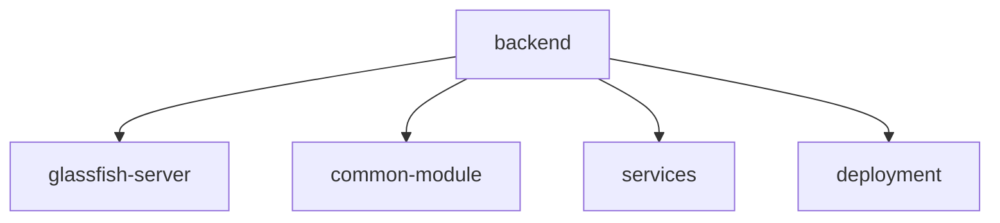
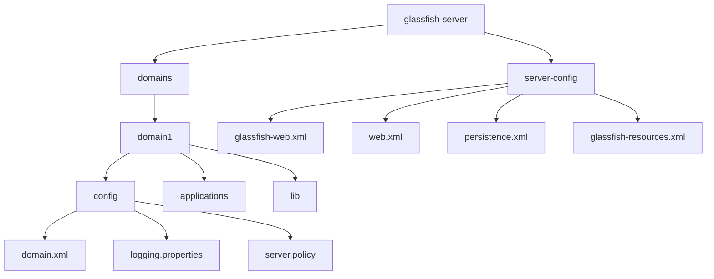
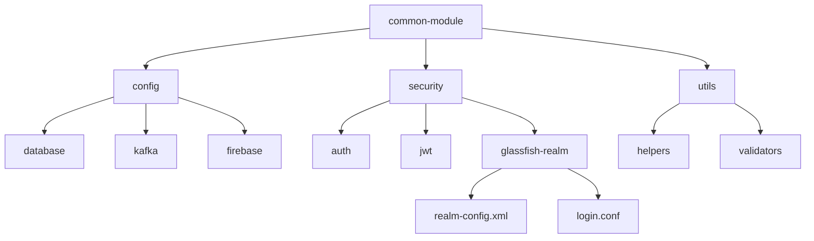
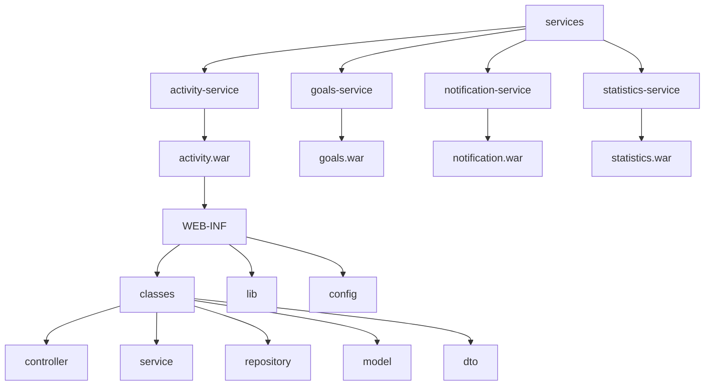
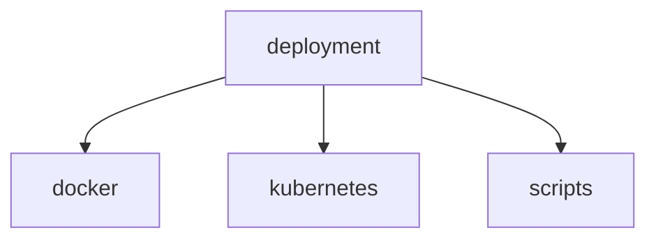

 

 -----
# Dossier d’Architecture Technique
## Introduction
Ce document présente l’architecture technique de l’application de suivi de fitness, décrivant les choix technologiques, les diagrammes de flux de données, les spécifications des composants, et la manière dont elle sera déployée.

- **Nom du projet** : **Gofit**
- **Objectif** :  Créer un système de suivi de fitness qui permet à un utilisateur de suivre ses activités physiques, de définir des objectifs de fitness, et de visualiser ses progrès au fil du temps. Ce système sera accessible via une application mobile et un tableau de bord web, offrant une expérience utilisateur complète et intuitive. 
- **Plateforme** : Web
- **Projet crée par** : Marouane BELBELLA

## Back-End
### Architecture Globale
L’application de suivi de fitness repose sur une architecture à base de microservices. Chaque service est conçu pour être indépendant et se concentrer sur une fonctionnalité spécifique.

Les principaux microservices sont :
1. Service d’Activités : Gère l’enregistrement, la mise à jour et la suppression des activités.
2. Service des Objectifs : Gère la création, le suivi et la mise à jour des objectifs de fitness.
3. Service de Notifications : Gère l’envoi des notifications push et email.
4. Service de Statistiques : Centralise les données pour les statistiques et les rapports affichés sur le tableau de bord.

Afin de visualiser clairement la structure du projet, ci-dessous un schéma d'organisation des fichiers du backend 

---

#### 1. **Structure principale**

---

#### 2. **Détails du serveur**

---

#### 3. **Module commun**

---

#### 4. **Services**

---

#### 5. **Détails du déploiement**

---

#### Service d’Activités
#### Service des Objectifs
#### Service de Notifications
#### Service de Statistiques
#### Diagramme de flux de données

```mermaid
sequenceDiagram
    participant User as Utilisateur
    participant Front as Frontend (Mobile/Web)
    participant AS as Service d'Activités
    participant DB as Base de Données SQLite
    participant Kafka as Message Broker Kafka
    participant GS as Service d'Objectifs
    participant NS as Service de Notifications
    participant FCM as Firebase Cloud Messaging
    
    %% Flux d'enregistrement d'activité
    rect rgb(38, 61, 81)
        Note over User,Kafka: Processus d'enregistrement d'activité
        User->>Front: Saisit une nouvelle activité
        Front->>+AS: POST /activities
        AS->>DB: Enregistre l'activité
        DB-->>AS: Confirmation
        AS->>Kafka: Publie événement "activity.created"
        AS-->>-Front: 201 Created
        Front-->>User: Affiche confirmation
    end
    
    %% Flux de notification d'objectif atteint
    rect rgb(108, 92, 73)
        Note over GS,User: Processus de notification
        GS->>GS: Vérifie objectifs
        GS->>Kafka: Publie "goal.achieved"
        Kafka-->>NS: Consomme événement
        NS->>FCM: Envoie notification push
        FCM-->>User: Reçoit notification
    end
```

### Choix Technologiques
### Deploiement
## Front-End