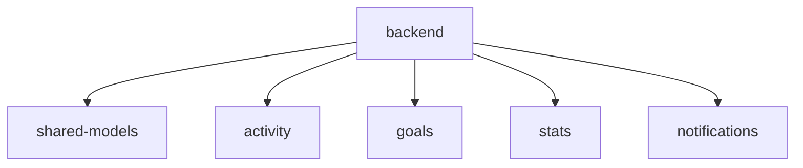
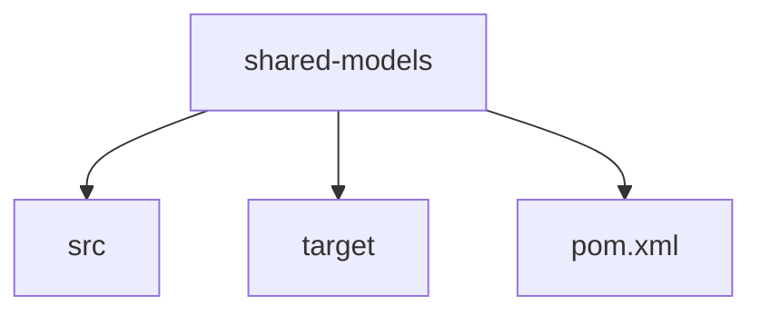
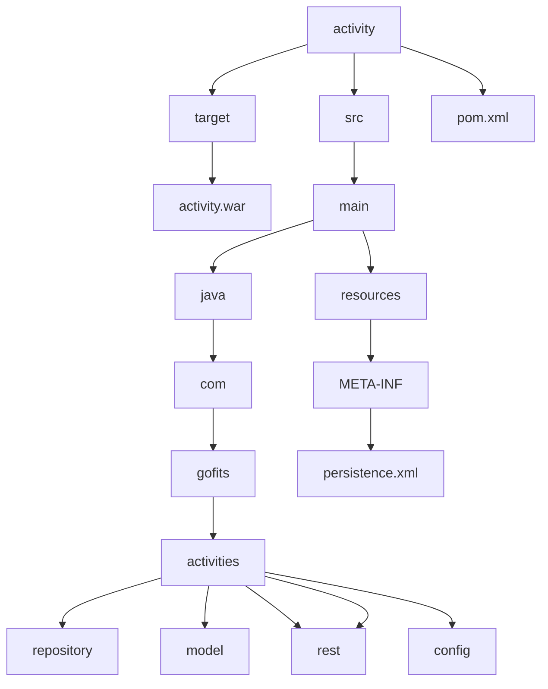

# Dossier d’Architecture Technique
## Introduction
Ce document présente l’architecture technique de l’application de suivi de fitness, décrivant les choix technologiques, les diagrammes de flux de données, les spécifications des composants, et la manière dont elle sera déployée.

- **Nom du projet** : **Gofit**
- **Objectif** :  Créer un système de suivi de fitness qui permet à un utilisateur de suivre ses activités physiques, de définir des objectifs de fitness, et de visualiser ses progrès au fil du temps. Ce système sera accessible via une application mobile et un tableau de bord web, offrant une expérience utilisateur complète et intuitive. 
- **Plateforme** : Web
- **Projet crée par** : Marouane BELBELLA
- **Cas d'utilisations** :  
    - Un seul utilisateur sur l'application
    - Enregistrer et suivre ses activités physiques.
    - Définir des objectifs de fitness personnalisés.
    - Visualiser ses progrès au fil du temps.
    - Recevoir des notifications et des rappels pour rester motivés et sur la bonne voie
## Back-End
### Architecture Globale
L’application de suivi de fitness repose sur une architecture à base de microservices. Chaque service est conçu pour être indépendant et se concentrer sur une fonctionnalité spécifique.

Les principaux microservices sont :
1. Service d’Activités : Gère l’enregistrement, la mise à jour et la suppression des activités.
2. Service des Objectifs : Gère la création, le suivi et la mise à jour des objectifs de fitness.
3. Service de Notifications : Gère l’envoi des notifications push et email.
4. Service de Statistiques : Centralise les données pour les statistiques et les rapports affichés sur le tableau de bord.

Afin de visualiser clairement la structure du projet, ci-dessous un schéma d'organisation des fichiers du backend 


#### 1. **Structure principale**



#### 2. **Module commun**



#### 3. **Services**



### Choix Technologiques

- **Jakarta EE 10** : Framework principal
  - Jakarta Persistence (JPA) pour la couche d'accès aux données
  - Jakarta RESTful Web Services (JAX-RS) pour les API REST
  - Jakarta Context and Dependency Injection (CDI) pour l'injection de dépendances
  - Jakarta Bean Validation pour la validation des données
- **Maven** : Gestion des dépendances et build
- **PostgreSQL 15** : Base de données relationnelle
- **Apache Kafka** : Message broker pour la communication inter-services


#### Service d’Activités


1. L'utilisateur commence par saisir les détails de son activité dans l'interface mobile ou web.

2. Le frontend transforme cette saisie en une requête POST structurée et l'envoie au Service d'Activités. Cette requête contient toutes les informations nécessaires comme le type d'activité, la durée, les calories, etc.

3. Le Service d'Activités effectue deux actions importantes en parallèle :
   - Il persiste les données dans la base de données SQLite pour un stockage permanent
   - Il publie un événement sur Kafka pour informer les autres services de cette nouvelle activité

4. Une fois ces opérations terminées, une confirmation est renvoyée à l'utilisateur à travers l'interface.


- La base de données pour le service des activités contient les informations relatives aux activités physiques enregistrées par l'utilisateur.


**Technologies Spécifiques**:
- Jakarta Persistence avec Hibernate comme provider
- Repository pattern pour l'accès aux données
- DTO pattern pour la transformation des données

**Structure Maven**:
```
activity-service/
├── src/
│   ├── main/
│   │   ├── java/
│   │   │   └── com/gofit/activity/
│   │   │       ├── controller/
│   │   │       ├── service/
│   │   │       ├── repository/
│   │   │       ├── model/
│   │   │       └── dto/
│   │   └── resources/
│   │       └── META-INF/
│   │           ├── persistence.xml
│   │           └── beans.xml
└── pom.xml
```

**Exemple de Configuration JPA (persistence.xml)**:
```xml
<?xml version="1.0" encoding="UTF-8"?>
<persistence version="3.0" xmlns="https://jakarta.ee/xml/ns/persistence">
    <persistence-unit name="ActivityPU" transaction-type="JTA">
        <provider>org.hibernate.jpa.HibernatePersistenceProvider</provider>
        <jta-data-source>java:app/jdbc/ActivityDS</jta-data-source>
        <properties>
            <property name="hibernate.dialect" value="org.hibernate.dialect.PostgreSQLDialect"/>
            <property name="hibernate.hbm2ddl.auto" value="update"/>
        </properties>
    </persistence-unit>
</persistence>
```
#### Service des Objectifs
- **Création d'un objectif** : Lorsque l'utilisateur définit un nouvel objectif via l'interface mobile ou web, l'objectif est envoyé via une requête HTTP (POST) au Service des Objectifs (GS). Ce service enregistre l'objectif dans la base de données SQLite. Une fois l'enregistrement effectué, un événement "goal.created" est publié sur Kafka pour informer les autres services du système de cette création.


**Technologies Spécifiques**:
- Jakarta Enterprise Beans (EJB) pour la logique métier
- Jakarta Scheduler pour les vérifications périodiques
- Events CDI pour la communication interne

**Structure des Packages**:
```java
com.gofit.goals
├── controller
│   └── GoalController.java
├── service
│   ├── GoalService.java
│   └── GoalScheduler.java
├── repository
│   └── GoalRepository.java
├── model
│   └── Goal.java
└── event
    ├── GoalCreatedEvent.java
    └── GoalAchievedEvent.java
```

- **Suivi des objectifs** : À intervalles réguliers, le service des objectifs vérifie si un objectif a été atteint. Si tel est le cas, il met à jour l'état de l'objectif dans la base de données et publie un événement "goal.achieved" sur Kafka.


- La base de données pour le service des objectifs contient les informations relatives aux objectifs définis par l'utilisateur.

#### Service de Notifications
1. Le Service d'Objectifs analyse régulièrement les progrès par rapport aux objectifs fixés.

2. Lorsqu'un objectif est atteint, il publie immédiatement un événement sur Kafka.

3. Le Service de Notifications, qui écoute en permanence ces événements :
   - Capture l'événement "goal.achieved"
   - Le transforme en notification appropriée
   - L'envoie au Front

4. Le Front affiche la notification à l'utilisateur.


- La base de données pour le service des notifications stocke les informations liées aux notifications envoyées à l'utilisateur.


**Technologies Spécifiques**:
- Jakarta WebSocket pour les notifications temps réel
- Kafka Consumer pour la réception des événements

**Configuration Kafka**:
```properties
bootstrap.servers=localhost:9092
group.id=notification-service
enable.auto.commit=true
key.deserializer=org.apache.kafka.common.serialization.StringDeserializer
value.deserializer=org.apache.kafka.common.serialization.StringDeserializer
```
#### Service de Statistiques
- **Mise à jour des statistiques** : Le Service de Statistiques (SS) reçoit des notifications via Kafka lorsque des événements pertinents se produisent, comme la création d'une activité ou l'atteinte d'un objectif. Il met à jour les statistiques dans la base de données SQLite en fonction des nouvelles données.


- **Affichage des statistiques** : Le frontend, lorsqu'il souhaite afficher les statistiques actualisées, interroge le Service des Statistiques pour récupérer les données mises à jour. Le service renvoie les informations de manière structurée et l'interface utilisateur les affiche en temps réel.


- La base de données pour le service des statistiques contient des informations agrégées sur les performances de l'utilisateur, comme la somme des calories brûlées ou la durée totale des activités.


**Technologies Spécifiques**:
- Jakarta Batch pour le traitement des données
- Jakarta Persistence avec des requêtes optimisées
- Materialized Views PostgreSQL pour les agrégations


### Deploiement
- **Serveur d'Application** : GlassFish
- **Base de Données** : PostgreSQL 15
- **Message Broker** : Apache Kafka 3.4


### Déploiement
[mise_en_place](mise_en_place.md)
### Structure du Front-End
```plaintext
frontend/
├── assets/
│   ├── favicon.ico
│   └── logo.jpg
├── css/
│   └── styles.css
├── js/
│   ├── activities.js
│   ├── main.js
│   ├── notifications.js
│   ├── objectives.js
│   └── statistics.js
├── activities.html
├── index.html
├── navbar.html
├── notifications.html
├── objectives.html
└── statistics.html
```

### Exemple de Service JavaScript
```javascript
class ActivityService {
    static async createActivity(activityData) {
        try {
            const response = await fetch('/api/activities', {
                method: 'POST',
                headers: {
                    'Content-Type': 'application/json',
                },
                body: JSON.stringify(activityData)
            });
            return await response.json();
        } catch (error) {
            console.error('Error creating activity:', error);
            throw error;
        }
    }
}
```